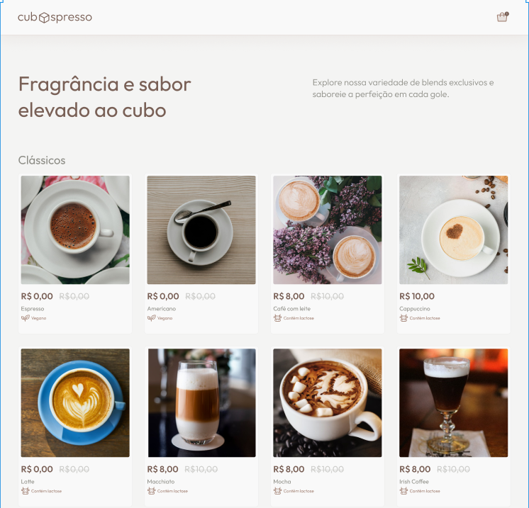

# Quero café ☕



> Desafio da "@Cubos academy" para testar o conhecimento na manipulação da DOM. Demonstração de interface para e-commerce de café.

## 💻 Pré-requisitos

Antes de começar, verifique se você atendeu aos seguintes requisitos:

- Você instalou a versão mais recente de `<node.js>`
- Você tem uma máquina `<Windows>`.
- Você leu `<guia / link / documentação_relacionada_ao_projeto>`.

## 🚀 Instalando Quero café ☕

Para instalar o Quero café ☕, siga estas etapas:

Windows:

```bash
# Clone este repositório
$ git clone git@github.com:arnaldohenrique/clone-desafio-progressivo-front-m2-t15

# Execute o index.html
```

## 📝 Licença

Esse projeto está sob licença. Veja o arquivo [LICENÇA](LICENSE.md) para mais detalhes.
